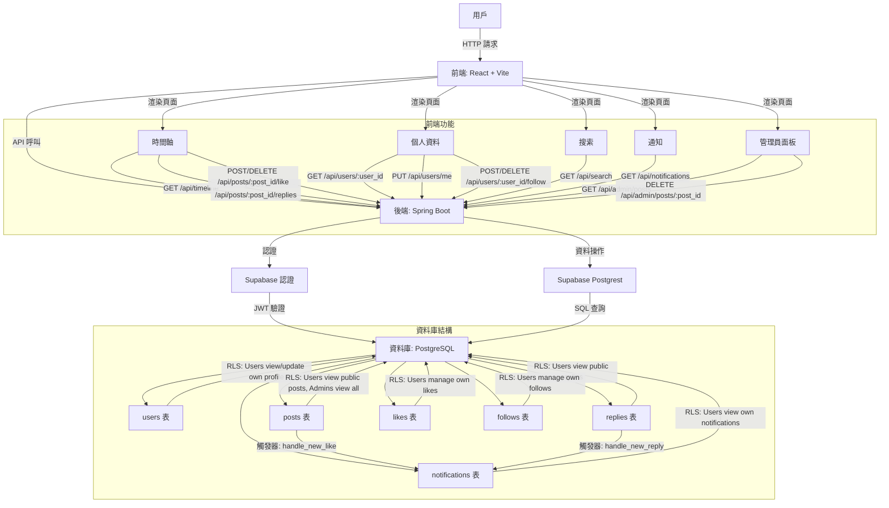

```
threads-clone/
├── backend/                                    # Spring Boot 後端專案
│   ├── src/
│   │   ├── main/
│   │   │   ├── java/com/threadsclone/backend/
│   │   │   │   ├── controller/              # 控制器
│   │   │   │   │   ├── AdminController.java
│   │   │   │   │   ├── FollowController.java
│   │   │   │   │   ├── NotificationController.java
│   │   │   │   │   ├── PostController.java
│   │   │   │   │   └── UserController.java
│   │   │   │   ├── dto/                    # 資料傳輸對象
│   │   │   │   │   ├── NotificationResponse.java
│   │   │   │   │   ├── PostRequest.java
│   │   │   │   │   ├── PostResponse.java
│   │   │   │   │   ├── UserRequest.java
│   │   │   │   │   └── UserResponse.java
│   │   │   │   ├── entity/                 # 實體類
│   │   │   │   │   ├── Follow.java
│   │   │   │   │   ├── Notification.java
│   │   │   │   │   └── Post.java
│   │   │   │   ├── service/                # 服務邏輯
│   │   │   │   │   ├── AdminService.java
│   │   │   │   │   ├── FollowService.java
│   │   │   │   │   ├── NotificationService.java
│   │   │   │   │   ├── PostService.java
│   │   │   │   │   └── UserService.java
│   │   │   ├── resources/
│   │   │   │   └── application.properties  # Supabase 配置
│   │   ├── test/
│   │   │   ├── java/com/threadsclone/backend/controller/
│   │   │   │   ├── AdminControllerTest.java
│   │   │   │   ├── AdminIntegrationTest.java
│   │   │   │   ├── FollowControllerTest.java
│   │   │   │   ├── FollowIntegrationTest.java
│   │   │   │   ├── NotificationControllerTest.java
│   │   │   │   ├── NotificationIntegrationTest.java
│   │   │   │   ├── PostControllerTest.java
│   │   │   │   ├── PostIntegrationTest.java
│   │   │   │   ├── UserControllerTest.java
│   │   │   │   └── UserIntegrationTest.java
│   ├── pom.xml                             # Maven 依賴
│   └── database/
│       ├── database-schema.sql             # 資料庫結構（users, posts, replies, likes, follows）
│       └── notifications.sql              # 通知表和觸發器
├── frontend/                                  # React 前端專案
│   ├── src/
│   │   ├── components/
│   │   │   ├── Timeline.jsx               # 時間軸組件
│   │   │   └── Timeline.test.jsx          # 時間軸測試
│   │   ├── lib/
│   │   │   └── supabase.js                # Supabase 客戶端配置
│   │   ├── pages/
│   │   │   ├── AdminPanel.jsx             # 管理員面板
│   │   │   ├── AdminPanel.test.jsx
│   │   │   ├── Notifications.jsx          # 通知頁面
│   │   │   ├── Notifications.test.jsx
│   │   │   ├── Profile.jsx                # 個人資料頁面
│   │   │   ├── Profile.test.jsx
│   │   │   ├── Search.jsx                 # 搜索頁面
│   │   │   └── Search.test.jsx
│   │   ├── App.jsx                        # 路由配置
│   │   ├── index.jsx                      # 入口文件
│   │   └── index.css                      # 全局樣式（Tailwind CSS）
│   ├── public/
│   │   ├── index.html                     # HTML 模板
│   │   └── favicon.ico                    # 圖標
│   ├── package.json                       # Node.js 依賴
│   ├── tailwind.config.js                 # Tailwind CSS 配置
│   └── vite.config.js                     # Vite 配置
├── README.md                              # 專案說明
└── .gitignore                             # Git 忽略文件
```


