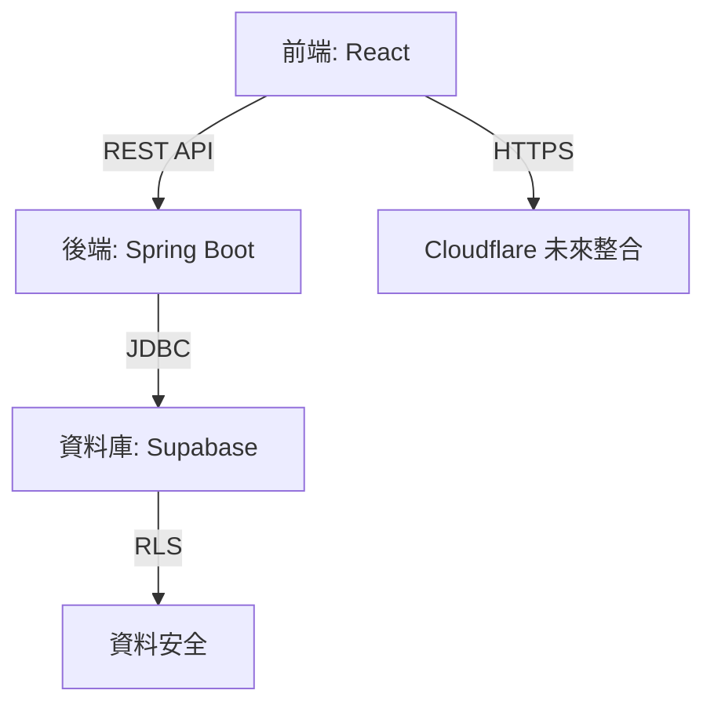
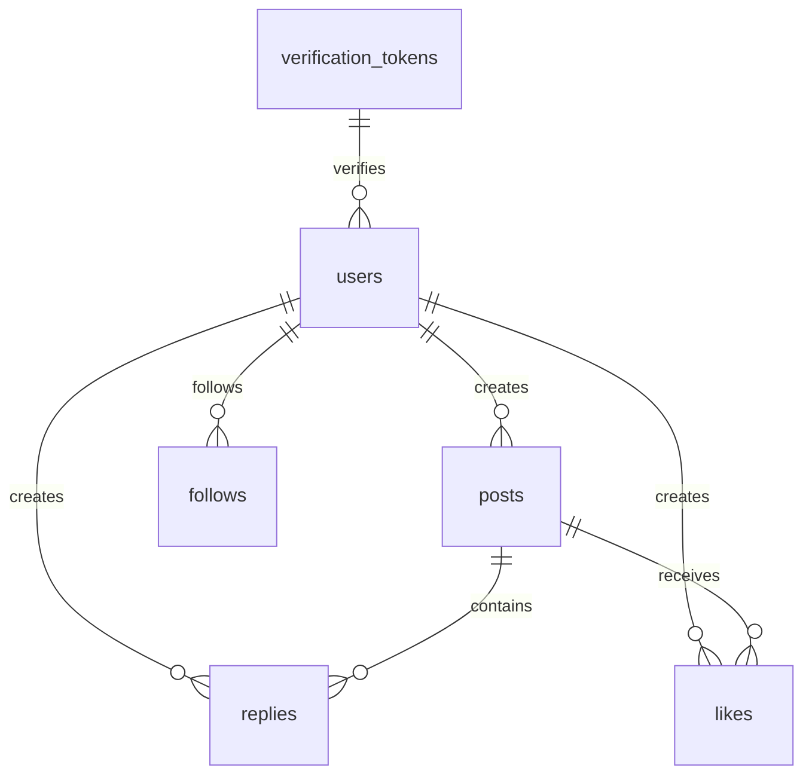

# Threads Clone 規格文件

## 1. 專案概述
本專案旨在開發一個類似 Threads 的社交媒體平台，使用者可發佈貼文、回覆、點讚、追蹤其他使用者，並支援搜尋功能。平台採用簡潔的卡片式介面，支援深色/淺色模式，後端使用 Spring Boot，前端使用 React，資料庫使用 Supabase（PostgreSQL）。開發採用測試驅動開發（TDD），確保高品質程式碼。

### 目標
- 提供動態時間軸（無限滾動），顯示使用者及其追蹤者的貼文。
- 支援匿名發文（需登入，隱藏真實身份）。
- 實現全文搜尋（貼文和回覆，按相關性排序）。
- 確保安全性和簡潔的使用者體驗。

### 非功能需求
- **後端**：Spring Boot，RESTful API，OpenAPI（Swagger）文件。
- **前端**：React，Tailwind CSS，支援深色/淺色模式和行動裝置適配。
- **資料庫**：Supabase 免費版（500 MB，PostgreSQL），使用 RLS（Row-Level Security）。
- **測試**：TDD，80% 單元測試覆蓋，50% 整合測試覆蓋。
- **安全性**：HTTPS、bcrypt、JWT、輸入驗證、速率限制。

---

## 2. 功能需求

### 2.1 使用者認證
- **註冊**：
  - 輸入：電子郵件（唯一）、使用者名稱（唯一，3-50 字元，字母/數字/下底線）、密碼（≥ 6 字元，無強度要求）。
  - 後端：密碼使用 bcrypt 雜湊，發送驗證郵件（含唯一連結，有效期 24 小時）。
  - 未驗證使用者可登入，但無法發文或回覆。
- **登入**：
  - 輸入：電子郵件、密碼。
  - 回應：JWT（有效期 24 小時）。
- **未登入使用者**：
  - 可查看時間軸、個人檔案、搜尋結果。
  - 無法發文、回覆、點讚或追蹤。
- **登出**：
  - 手動登出：清除前端 JWT（`localStorage`），重定向至首頁。
  - 無自動登出（無閒置超時）。

### 2.2 貼文管理
- **創建貼文**：
  - 內容：Markdown 格式，≤ 500 字。
  - 圖片：外部 URL（`.jpg`、`.png`、`.gif`，≤ 255 字元）。
  - 匿名選項：勾選「匿名」，顯示為「Anonymous」，管理員可查看真實 `user_id`。
  - 需登入且電子郵件驗證。
- **刪除貼文**：
  - 軟刪除（`is_deleted = TRUE`）。
  - 權限：貼文擁有者或管理員。
- **點讚**：
  - 每人每篇貼文限點一次，記錄點讚使用者。
  - 顯示點讚數，不突出已點讚狀態。
- **時間軸**：
  - 無限滾動，顯示自己和追蹤者的貼文（`created_at` 倒序）。
  - 每次加載 20 條，支援游標分頁（`next_cursor`）。

### 2.3 回覆管理
- **創建回覆**：
  - 內容：Markdown 格式，≤ 200 字，單層（無巢狀）。
  - 圖片：外部 URL（同貼文）。
  - 匿名選項：顯示為「Anonymous」。
  - 需登入且電子郵件驗證。
- **刪除回覆**：
  - 軟刪除。
  - 權限：回覆者或管理員。
- **排序**：
  - 選項：時間順序（`created_at` 升序）、倒序（預設）。
  - 前端下拉選單切換。

### 2.4 追蹤系統
- **追蹤/取消追蹤**：
  - 點擊按鈕（「追蹤」/「取消追蹤」）。
  - 限制：無法追蹤自己。
- **個人檔案**：
  - 顯示：使用者名稱、簡介（≤ 160 字）、貼文數、追蹤者數、追蹤中數。
  - 貼文列表：無限滾動，`created_at` 倒序。
  - 互動：追蹤/取消追蹤按鈕。

### 2.5 搜尋功能
- **範圍**：貼文和回覆（`is_deleted = FALSE`）。
- **排序**：相關性（`ts_rank`），次按 `created_at` 倒序。
- **前端**：搜尋欄提交查詢，顯示結果列表（類型、摘要、連結）。
- **未來**：即時搜尋（輸入時動態顯示）。

### 2.6 管理員功能
- **刪除**：可刪除任何貼文或回覆（軟刪除）。
- **匿名資訊**：查看匿名貼文的真實 `user_id` 和 `username`。
- API：`GET /admin/posts?anonymous=true`。

---

## 3. 架構選擇

### 3.1 技術棧
- **後端**：
  - Spring Boot（`spring-boot-starter-web`、`spring-boot-starter-data-jpa`、`spring-boot-starter-security`）。
  - Supabase（PostgreSQL，免費版 500 MB）。
  - OpenAPI（`springdoc-openapi`）。
- **前端**：
  - React（Vite，`react-router-dom`、`react-markdown`、`dompurify`）。
  - Tailwind CSS（深色模式、響應式）。
- **資料庫**：Supabase，支援 RLS 和全文搜尋（`tsvector`）。
- **測試**：JUnit 5、Mockito、Spring Boot Test。

### 3.2 系統架構


- **前端**：單頁應用（SPA），透過 API 與後端互動。
- **後端**：RESTful API，處理業務邏輯，連線 Supabase。
- **資料庫**：Supabase 托管 PostgreSQL，RLS 確保權限控制。
- **未來**：Cloudflare 提供 DDoS 保護和 Turnstile 驗證。

---

## 4. 資料處理細節

### 4.1 資料庫結構
```sql
CREATE TABLE users (
  id UUID PRIMARY KEY DEFAULT uuid_generate_v4(),
  email TEXT UNIQUE NOT NULL,
  username TEXT UNIQUE NOT NULL CHECK (LENGTH(username) >= 3 AND LENGTH(username) <= 50),
  bio TEXT CHECK (LENGTH(bio) <= 160),
  password_hash TEXT NOT NULL,
  is_verified BOOLEAN DEFAULT FALSE,
  role TEXT DEFAULT 'user' CHECK (role IN ('user', 'admin')),
  created_at TIMESTAMP WITH TIME ZONE DEFAULT NOW()
);

CREATE TABLE posts (
  id UUID PRIMARY KEY DEFAULT uuid_generate_v4(),
  content TEXT NOT NULL CHECK (LENGTH(content) <= 500),
  content_tsv TSVECTOR GENERATED ALWAYS AS (to_tsvector('simple', content)) STORED,
  image_url TEXT CHECK (LENGTH(image_url) <= 255),
  user_id UUID REFERENCES users(id) ON DELETE SET NULL,
  is_anonymous BOOLEAN DEFAULT FALSE,
  is_deleted BOOLEAN DEFAULT FALSE,
  likes_count INT DEFAULT 0 CHECK (likes_count >= 0),
  replies_count INT DEFAULT 0 CHECK (replies_count >= 0),
  created_at TIMESTAMP WITH TIME ZONE DEFAULT NOW()
);

CREATE TABLE replies (
  id UUID PRIMARY KEY DEFAULT uuid_generate_v4(),
  post_id UUID REFERENCES posts(id) ON DELETE CASCADE,
  content TEXT NOT NULL CHECK (LENGTH(content) <= 200),
  content_tsv TSVECTOR GENERATED ALWAYS AS (to_tsvector('simple', content)) STORED,
  image_url TEXT CHECK (LENGTH(image_url) <= 255),
  user_id UUID REFERENCES users(id) ON DELETE SET NULL,
  is_anonymous BOOLEAN DEFAULT FALSE,
  is_deleted BOOLEAN DEFAULT FALSE,
  created_at TIMESTAMP WITH TIME ZONE DEFAULT NOW()
);

CREATE TABLE likes (
  user_id UUID REFERENCES users(id) ON DELETE CASCADE,
  post_id UUID REFERENCES posts(id) ON DELETE CASCADE,
  created_at TIMESTAMP WITH TIME ZONE DEFAULT NOW(),
  PRIMARY KEY (user_id, post_id)
);

CREATE TABLE follows (
  follower_id UUID REFERENCES users(id) ON DELETE CASCADE,
  followed_id UUID REFERENCES users(id) ON DELETE CASCADE,
  created_at TIMESTAMP WITH TIME ZONE DEFAULT NOW(),
  PRIMARY KEY (follower_id, followed_id)
);

CREATE TABLE verification_tokens (
  token UUID PRIMARY KEY DEFAULT uuid_generate_v4(),
  user_id UUID REFERENCES users(id) ON DELETE CASCADE,
  created_at TIMESTAMP WITH TIME ZONE DEFAULT NOW(),
  expires_at TIMESTAMP WITH TIME ZONE DEFAULT NOW() + INTERVAL '24 hours'
);
```

### 4.2 索引
```sql
CREATE INDEX idx_posts_content_tsv ON posts USING GIN(content_tsv);
CREATE INDEX idx_replies_content_tsv ON replies USING GIN(content_tsv);
CREATE INDEX idx_posts_user_id ON posts(user_id);
CREATE INDEX idx_posts_is_deleted ON posts(is_deleted);
CREATE INDEX idx_replies_post_id ON replies(post_id, created_at);
CREATE INDEX idx_replies_is_deleted ON replies(is_deleted);
CREATE INDEX idx_likes_post_id ON likes(post_id);
CREATE INDEX idx_follows_follower_id ON follows(follower_id);
CREATE INDEX idx_follows_followed_id ON follows(followed_id);
```

### 4.3 RLS（Supabase）
- **Users**：
  ```sql
  CREATE POLICY "Users view own profile" ON users FOR SELECT USING (id = auth.uid());
  CREATE POLICY "Admins view all users" ON users FOR SELECT USING (auth.role() = 'admin');
  ```
- **Posts**：
  ```sql
  CREATE POLICY "Public view non-deleted posts" ON posts FOR SELECT USING (is_deleted = FALSE);
  CREATE POLICY "Users create posts" ON posts FOR INSERT WITH CHECK (auth.uid() IS NOT NULL AND is_verified = TRUE);
  CREATE POLICY "Users delete own posts" ON posts FOR UPDATE USING (user_id = auth.uid());
  CREATE POLICY "Admins delete all posts" ON posts FOR UPDATE USING (auth.role() = 'admin');
  CREATE POLICY "Admins view anonymous user info" ON posts FOR SELECT USING (auth.role() = 'admin');
  ```
- **Replies**：
  ```sql
  CREATE POLICY "Public view non-deleted replies" ON replies FOR SELECT USING (is_deleted = FALSE);
  CREATE POLICY "Users create replies" ON replies FOR INSERT WITH CHECK (auth.uid() IS NOT NULL AND is_verified = TRUE);
  CREATE POLICY "Users delete own replies" ON replies FOR UPDATE USING (user_id = auth.uid());
  CREATE POLICY "Admins delete all replies" ON replies FOR UPDATE USING (auth.role() = 'admin');
  ```
- **Likes**：
  ```sql
  CREATE POLICY "Users manage own likes" ON likes FOR ALL USING (user_id = auth.uid());
  ```
- **Follows**：
  ```sql
  CREATE POLICY "Users manage own follows" ON follows FOR ALL USING (follower_id = auth.uid());
  ```

### 4.4 API 端點（RESTful）
- **認證**：
  - `POST /api/register`：註冊（電子郵件、使用者名稱、密碼）。
  - `POST /api/login`：登入（返回 JWT）。
  - `GET /api/verify?token=uuid`：驗證電子郵件。
- **貼文**：
  - `POST /api/posts`：創建貼文（需 JWT）。
  - `GET /api/timeline`：時間軸（公開，無限滾動）。
  - `DELETE /api/posts/:post_id`：刪除貼文（擁有者或管理員）。
  - `POST /api/posts/:post_id/like`：點讚（需 JWT）。
  - `DELETE /api/posts/:post_id/like`：取消點讚。
- **回覆**：
  - `POST /api/posts/:post_id/replies`：創建回覆（需 JWT）。
  - `GET /api/posts/:post_id/replies?sort=desc`：獲取回覆（公開）。
  - `DELETE /api/replies/:reply_id`：刪除回覆（擁有者或管理員）。
- **追蹤**：
  - `POST /api/follow/:user_id`：追蹤（需 JWT）。
  - `DELETE /api/follow/:user_id`：取消追蹤。
  - `GET /api/users/:user_id`：個人檔案（公開）。
  - `GET /api/users/:user_id/posts`：使用者貼文（公開）。
- **搜尋**：
  - `GET /api/search?q=關鍵字`：全文搜尋（公開）。
- **管理員**：
  - `GET /api/admin/posts?anonymous=true`：查看匿名貼文（需管理員權限）。
- **OpenAPI 文件**：
  - 透過 `springdoc-openapi` 生成，訪問：`/swagger-ui.html`。

---

## 5. 錯誤處理策略
- **原則**：
  - 前端顯示簡潔、用戶友好的錯誤訊息，隱藏技術細節（防止資訊洩露）。
  - 後端返回標準化錯誤格式：
    ```json
    {
      "error": "錯誤描述",
      "code": "ERROR_CODE"
    }
    ```
- **常見錯誤**：
  - 無效圖片 URL：`400`，「請輸入有效的圖片 URL」。
  - 貼文內容過長：`400`，「貼文內容太長，請縮短至 500 字」。
  - 未驗證使用者發文：`403`，「請檢查郵件並完成驗證」。
  - 無效 JWT：`401`，「登入已過期，請重新登入」。
  - 伺服器錯誤：`500`，「系統忙碌，請稍後再試」。
- **前端實現**：
  ```jsx
  function PostForm() {
    const [error, setError] = useState('');
    const handleSubmit = async () => {
      try {
        await fetch('/api/posts', { method: 'POST', body: JSON.stringify({ content }) });
      } catch (err) {
        const data = await err.response.json();
        setError(data.error);
      }
    };
    return (
      <div>
        {error && <div className="text-red-500">{error}</div>}
        <textarea />
        <button onClick={handleSubmit}>發布</button>
      </div>
    );
  }
  ```
- **後端實現**：
  ```java
  @RestControllerAdvice
  public class GlobalExceptionHandler {
    @ExceptionHandler(IllegalArgumentException.class)
    public ResponseEntity<ErrorResponse> handleBadRequest(Exception ex) {
      return ResponseEntity.badRequest().body(new ErrorResponse(ex.getMessage(), "INVALID_INPUT"));
    }
    @ExceptionHandler(Exception.class)
    public ResponseEntity<ErrorResponse> handleServerError(Exception ex) {
      return ResponseEntity.status(500).body(new ErrorResponse("伺服器錯誤，請稍後再試", "INTERNAL_ERROR"));
    }
  }
  ```

---

## 6. 測試計劃
- **策略**：TDD，確保程式碼品質。
- **工具**：
  - JUnit 5（單元測試）。
  - Mockito（模擬依賴）。
  - Spring Boot Test（整合測試）。
- **測試類型**：
  - **單元測試**（80% 覆蓋）：
    - 控制器（API 端點邏輯）。
    - 服務層（業務邏輯，如貼文創建、點讚計數）。
    - 示例：
      ```java
      @SpringBootTest
      class PostServiceTest {
        @MockBean
        private PostRepository postRepository;
        @Autowired
        private PostService postService;

        @Test
        void shouldCreatePostSuccessfully() {
          PostDTO postDTO = new PostDTO("內容", false);
          User user = new User("user_id", "email", true);
          Post post = new Post("post_id", postDTO.getContent(), user.getId(), false);

          when(postRepository.save(any(Post.class))).thenReturn(post);

          Post createdPost = postService.createPost(postDTO, user);

          assertEquals(postDTO.getContent(), createdPost.getContent());
          verify(postRepository).save(any(Post.class));
        }
      }
      ```
  - **整合測試**（50% 覆蓋）：
    - API 端點（`/register`、`/posts`、`/search`）。
    - 資料庫互動（Supabase，測試 RLS）。
    - 示例：
      ```java
      @SpringBootTest(webEnvironment = SpringBootTest.WebEnvironment.RANDOM_PORT)
      class PostControllerIntegrationTest {
        @Autowired
        private TestRestTemplate restTemplate;

        @Test
        void shouldReturnTimelinePosts() {
          ResponseEntity<Post[]> response = restTemplate.getForEntity("/api/timeline", Post[].class);
          assertEquals(HttpStatus.OK, response.getStatusCode());
          assertNotNull(response.getBody());
        }
      }
      ```
- **優先測試功能**：
  - 認證（註冊、登入、驗證）。
  - 貼文（創建、刪除、匿名）。
  - 回覆（創建、排序）。
  - 點讚（單次點讚、計數）。
  - 搜尋（相關性、性能）。
  - 管理員（權限、匿名資訊）。
- **測試結構**：
  ```
  src/test/java
  ├── controller/
  ├── service/
  ├── repository/
  └── integration/
  ```

---

## 7. 開發順序
- **階段 1：資料庫設計**（1-2 週）：
  - 創建表、索引、RLS。
  - 測試：Supabase CLI 驗證結構。
- **階段 2：後端核心**（3-4 週）：
  - 認證、貼文、回覆、點讚。
  - TDD：單元測試（控制器、服務）、整合測試（API）。
  - 生成 OpenAPI 文件。
- **階段 3：前端基礎**（2-3 週）：
  - 登入/註冊表單。
  - 時間軸、貼文/回覆表單。
  - 深色模式、行動適配。
- **階段 4：進階功能**（2-3 週）：
  - 搜尋、追蹤、個人檔案、管理員功能。
- **階段 5：整合與優化**（1-2 週）：
  - 整合前端後端。
  - 性能優化（索引、快取）。
  - 最終測試。

---

## 8. 交付方式
- **GitHub 儲存庫**：
  - 結構：
    ```
    /threads-clone
    ├── /backend
    │   ├── src/main/java
    │   ├── src/test/java
    │   ├── pom.xml
    │   └── README.md
    ├── /frontend
    │   ├── src
    │   ├── public
    │   ├── package.json
    │   └── README.md
    ├── /docs
    │   ├── specification.md
    │   ├── api-docs.yaml
    │   └── database-schema.sql
    └── README.md
    ```
  - 包含 CI/CD（GitHub Actions）。
- **規格文件**（`docs/specification.md`）：
  - 功能、資料庫、API、測試、未來功能。
  - 附錄：Mermaid 結構圖、環境變數。
- **額外資源**：
  - OpenAPI 文件（`/swagger-ui.html`）。
  - 資料庫腳本（`database-schema.sql`）。
  - Postman 集合。
- **環境變數**：
  ```env
  SUPABASE_URL=https://<project>.supabase.co
  SUPABASE_KEY=<key>
  JWT_SECRET=<secret>
  EMAIL_SERVICE_API_KEY=<sendgrid_key>
  ```

---

## 9. 未來功能
- 即時搜尋。
- 圖片上傳（Supabase Storage，100 KB）。
- Cloudflare Turnstile（隱形驗證）。
- 資料清理（過期貼文）。
- 第三方登入（Google）。
- Markdown 即時預覽。
- 多語言（英文、簡體中文）。

---

## 10. 開發者支援
- **無經驗工程師指南**：
  - 詳細 `README.md`（安裝、執行、測試）。
  - 程式碼範例（Spring Boot 控制器、React 組件）。
  - 學習資源：
    - Spring Boot 官方教程。
    - React 官方文件。
    - Supabase 快速入門。
- **TDD 入門**：
  - JUnit 5 和 Mockito 範例。
  - 每個功能附上測試案例。
- **Supabase 配置**：
  - 提供 `database-schema.sql` 和 RLS 腳本。
  - 說明連線方式（JDBC）。

---

## 附錄

### 資料庫結構圖


### 環境變數範例
```env
SUPABASE_URL=https://<project>.supabase.co
SUPABASE_KEY=<key>
JWT_SECRET=<secret>
EMAIL_SERVICE_API_KEY=<sendgrid_key>
```

### 安裝與執行
1. **後端**：
   ```bash
   cd backend
   mvn install
   mvn spring-boot:run
   ```
2. **前端**：
   ```bash
   cd frontend
   npm install
   npm run dev
   ```
3. **Supabase**：
   - 初始化專案，匯入 `database-schema.sql`。
   - 配置 RLS 和環境變數。