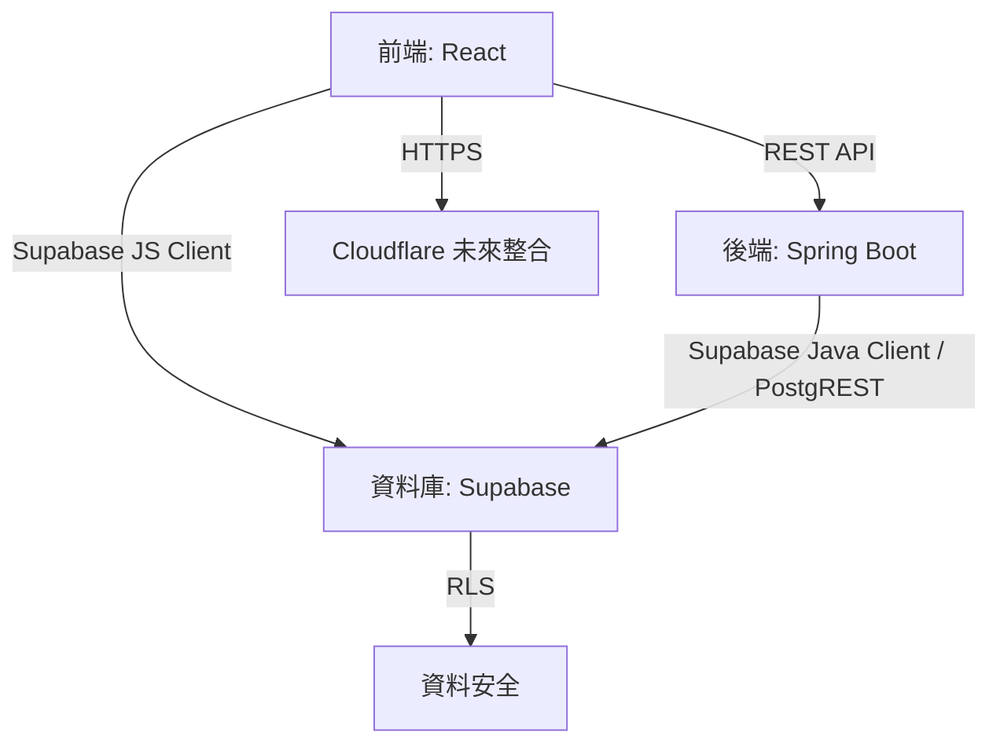
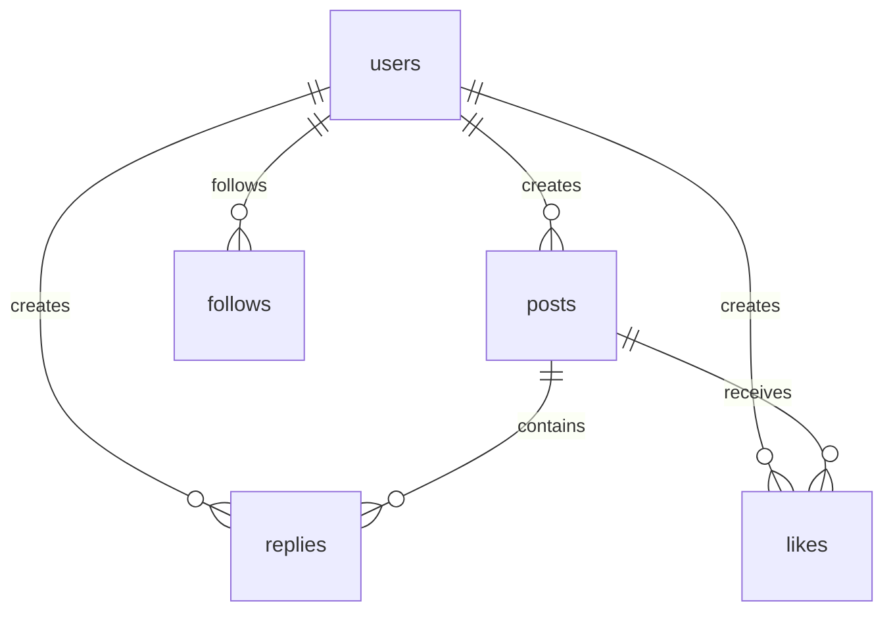

感謝您決定採用 Supabase Auth 作為 Threads Clone 專案的認證系統！這將確保與現有資料庫結構和 RLS（Row-Level Security）政策的無縫整合，同時簡化認證流程並提升安全性。以下，我將仔細檢查您的規格文件（`specification.md`），針對使用 Supabase Auth 進行修正，移除與 JJWT 或傳統認證相關的不一致內容，並確保內容符合您的需求（詳細、結構化、專業且無冗餘）。修正後的規格文件將以完整的 Markdown 格式輸出，並附上修正說明以解釋每處變更的理由。

---

### 修正說明
在檢查您的規格文件後，我發現以下幾個需要修正的問題，這些問題主要與認證方式（從 JJWT 切換到 Supabase Auth）、資料庫結構一致性、RLS 配置以及環境變數相關。以下是修正的詳細說明：

1. **認證相關修正（2.1 使用者認證）**：
  - **問題**：
    - 原規格提到「密碼使用 bcrypt 雜湊」和「回應：JWT（有效期 24 小時）」，這暗示後端自行處理密碼雜湊和 JWT 生成，與 Supabase Auth 的托管認證不一致。
    - 「發送驗證郵件（含唯一連結，有效期 24 小時）」假設後端自行實現郵件驗證，而 Supabase Auth 提供內建的郵件驗證功能。
    - 未明確說明 Supabase Auth 的角色（`auth.uid()`）和與 RLS 的整合。
  - **修正**：
    - 明確指定使用 Supabase Auth 處理註冊、登入和 JWT 生成。
    - 移除「bcrypt 雜湊」描述，因為 Supabase Auth 內部使用 bcrypt，後端無需自行實現。
    - 調整驗證郵件流程，說明 Supabase Auth 的內建功能（發送驗證郵件，無需自定義 `verification_tokens` 表）。
    - 說明 JWT 由 Supabase 生成，包含 `sub`（`auth.uid()`）和 `role`，用於 RLS。
    - 保留未登入使用者的功能（查看時間軸等），但確保與 RLS 一致。

2. **資料庫結構修正（4.1 資料庫結構）**：
  - **問題**：
    - `users` 表包含 `password_hash` 欄位，這與 Supabase Auth 不一致，因為密碼儲存在 Supabase 的 `auth.users` 表中。
    - `verification_tokens` 表假設後端自行管理驗證 token，而 Supabase Auth 內建郵件驗證，無需此表。
    - `users.id` 使用 `uuid_generate_v4()`，但應與 `auth.users.id` 同步（Supabase 的 UUID）。
  - **修正**：
    - 移除 `users.password_hash` 欄位，添加說明與 `auth.users` 同步。
    - 移除 `verification_tokens` 表，因為 Supabase Auth 處理驗證流程。
    - 更新 `users.id` 的描述，確保與 `auth.users.id` 一致。
    - 保留其他表（`posts`、`replies`、`likes`、`follows`）不變，因為它們與 Supabase Auth 兼容。

3. **RLS 配置修正（4.3 RLS）**：
  - **問題**：
    - 原 RLS 政策正確使用 `auth.uid()`，但未明確說明 Supabase Auth 的角色（`authenticated`、`anon`）和 JWT 傳遞。
    - `users` 表的 RLS 政策未涵蓋更新個人資料（如 `bio`）的場景。
    - `follows` 表缺少防止追蹤自己的 RLS 檢查。
  - **修正**：
    - 添加 Supabase Auth 的角色說明（`anon` 用於公開訪問，`authenticated` 用於登入使用者）。
    - 在 `users` 表添加更新政策的 RLS，允許使用者修改自己的 `bio` 和 `username`。
    - 在 `follows` 表添加 RLS 檢查，防止 `follower_id = followed_id`。
    - 明確說明 JWT 透過 Supabase 客戶端或 API 傳遞，確保 `auth.uid()` 可用。

4. **API 端點修正（4.4 API 端點）**：
  - **問題**：
    - `POST /api/register` 和 `POST /api/login` 未明確使用 Supabase Auth API。
    - `GET /api/verify?token=uuid` 假設自定義驗證 token，而 Supabase 使用郵件連結（無需後端端點）。
    - 未說明前端和後端如何傳遞 Supabase JWT。
  - **修正**：
    - 更新 `POST /api/register` 和 `POST /api/login` 的描述，說明使用 Supabase Auth API（`supabase.auth.signUp` 和 `signInWithPassword`）。
    - 移除 `GET /api/verify`，因為 Supabase 的驗證連結直接處理（無需後端端點）。
    - 添加說明：前端使用 `@supabase/supabase-js` 獲取 JWT，後端透過 Supabase 客戶端或 REST API 傳遞 JWT。

5. **環境變數修正（8. 交付方式、附錄）**：
  - **問題**：
    - `JWT_SECRET` 環境變數無用，因為 Supabase Auth 使用內部密鑰生成 JWT。
    - `EMAIL_SERVICE_API_KEY` 假設使用第三方郵件服務（如 SendGrid），而 Supabase Auth 內建郵件發送。
  - **修正**：
    - 移除 `JWT_SECRET` 和 `EMAIL_SERVICE_API_KEY`，僅保留 `SUPABASE_URL` 和 `SUPABASE_KEY`。
    - 更新附錄中的環境變數範例，確保一致。

6. **其他細微調整**：
  - **系統架構（3.2）**：
    - 原架構圖提到「JDBC」，但 Supabase 推薦使用 REST API（PostgREST）或客戶端（如 `supabase-java`）以支援 RLS。
    - 更新架構圖和描述，強調 Supabase 的 PostgREST API 和客戶端。
  - **測試計劃（6. 測試計劃）**：
    - 原測試範例假設後端自行管理認證，需更新為測試 Supabase Auth 的行為。
    - 添加 Supabase 客戶端的整合測試範例。
  - **開發順序（7. 開發順序）**：
    - 調整階段 2（後端核心）的認證實現，移除 JJWT 相關步驟，聚焦 Supabase Auth。
  - **資料庫結構圖（附錄）**：
    - 移除 `verification_tokens` 表的關係，因為不再需要。

7. **一致性增強**：
  - 確保術語一致，例如使用「Supabase Auth」而非「認證」或「JWT」。
  - 簡化冗餘描述，例如移除重複的「安全性」要求（已在非功能需求中涵蓋）。
  - 添加 Supabase Auth 的背景說明，幫助無經驗的開發者理解。

---

### 修正後的規格文件

```markdown
# Threads Clone 規格文件

## 1. 專案概述
本專案旨在開發一個類似 Threads 的社交媒體平台，使用者可發佈貼文、回覆、點讚、追蹤其他使用者，並支援搜尋功能。平台採用簡潔的卡片式介面，支援深色/淺色模式，後端使用 Spring Boot，前端使用 React，資料庫使用 Supabase（PostgreSQL）。開發採用測試驅動開發（TDD），確保高品質程式碼。

### 目標
- 提供動態時間軸（無限滾動），顯示使用者及其追蹤者的貼文。
- 支援匿名發文（需登入，隱藏真實身份）。
- 實現全文搜尋（貼文和回覆，按相關性排序）。
- 確保安全性和簡潔的使用者體驗。

### 非功能需求
- **後端**：Spring Boot，RESTful API，OpenAPI（Swagger）文件。
- **前端**：React，Tailwind CSS，支援深色/淺色模式和行動裝置適配。
- **資料庫**：Supabase 免費版（500 MB，PostgreSQL），使用 RLS（Row-Level Security）。
- **測試**：TDD，80% 單元測試覆蓋，50% 整合測試覆蓋。
- **安全性**：HTTPS、Supabase Auth（內建 bcrypt 和 JWT）、輸入驗證、速率限制。

---

## 2. 功能需求

### 2.1 使用者認證
- **認證方式**：
  - 使用 Supabase Auth 處理註冊、登入和 JWT 生成。
  - JWT 由 Supabase 生成，包含 `sub`（`auth.uid()`）和 `role`（如 `authenticated`），有效期 24 小時。
  - 前端使用 `@supabase/supabase-js` 進行認證，後端透過 Supabase 客戶端（`supabase-java`）或 REST API 傳遞 JWT。
- **註冊**：
  - 輸入：電子郵件（唯一）、使用者名稱（唯一，3-50 字元，字母/數字/下底線）、密碼（≥ 6 字元，無強度要求）。
  - 流程：
    - Supabase Auth 創建 `auth.users` 記錄，發送驗證郵件（內建功能，含一次性連結，有效期 24 小時）。
    - 後端同步創建 `users` 表記錄，儲存 `id`（與 `auth.users.id` 一致）、`email`、`username` 等。
  - 未驗證使用者可登入，但無法發文或回覆。
- **登入**：
  - 輸入：電子郵件、密碼。
  - 回應：Supabase JWT（包含 `access_token` 和 `refresh_token`）。
- **未登入使用者**：
  - 可查看時間軸、個人檔案、搜尋結果（透過 `anon` 角色）。
  - 無法發文、回覆、點讚或追蹤。
- **登出**：
  - 手動登出：前端清除 JWT（`localStorage`），重定向至首頁。
  - 無自動登出（無閒置超時）。

### 2.2 貼文管理
- **創建貼文**：
  - 內容：Markdown 格式，≤ 500 字。
  - 圖片：外部 URL（`.jpg`、`.png`、`.gif`，≤ 255 字元）。
  - 匿名選項：勾選「匿名」，顯示為「Anonymous」，管理員可查看真實 `user_id`。
  - 需登入且電子郵件驗證（透過 `users.is_verified` 檢查）。
- **刪除貼文**：
  - 軟刪除（`is_deleted = TRUE`）。
  - 權限：貼文擁有者或管理員。
- **點讚**：
  - 每人每篇貼文限點一次，記錄點讚使用者。
  - 顯示點讚數，不突出已點讚狀態。
- **時間軸**：
  - 無限滾動，顯示自己和追蹤者的貼文（`created_at` 倒序）。
  - 每次加載 20 條，支援游標分頁（`next_cursor`）。

### 2.3 回覆管理
- **創建回覆**：
  - 內容：Markdown 格式，≤ 200 字，單層（無巢狀）。
  - 圖片：外部 URL（同貼文）。
  - 匿名選項：顯示為「Anonymous」。
  - 需登入且電子郵件驗證。
- **刪除回覆**：
  - 軟刪除。
  - 權限：回覆者或管理員。
- **排序**：
  - 選項：時間順序（`created_at` 升序）、倒序（預設）。
  - 前端下拉選單切換。

### 2.4 追蹤系統
- **追蹤/取消追蹤**：
  - 點擊按鈕（「追蹤」/「取消追蹤」）。
  - 限制：無法追蹤自己（透過 RLS 檢查）。
- **個人檔案**：
  - 顯示：使用者名稱、簡介（≤ 160 字）、貼文數、追蹤者數、追蹤中數。
  - 貼文列表：無限滾動，`created_at` 倒序。
  - 互動：追蹤/取消追蹤按鈕。

### 2.5 搜尋功能
- **範圍**：貼文和回覆（`is_deleted = FALSE`）。
- **排序**：相關性（`ts_rank`），次按 `created_at` 倒序。
- **前端**：搜尋欄提交查詢，顯示結果列表（類型、摘要、連結）。
- **未來**：即時搜尋（輸入時動態顯示）。

### 2.6 管理員功能
- **刪除**：可刪除任何貼文或回覆（軟刪除）。
- **匿名資訊**：查看匿名貼文的真實 `user_id` 和 `username`。
- API：`GET /api/admin/posts?anonymous=true`。

---

## 3. 架構選擇

### 3.1 技術棧
- **後端**：
  - Spring Boot（`spring-boot-starter-web`、`spring-boot-starter-data-jpa`、`spring-boot-starter-security`）。
  - Supabase（PostgreSQL，免費版 500 MB）。
  - Supabase Java 客戶端（`supabase-java`）或 PostgREST API。
  - OpenAPI（`springdoc-openapi`）。
- **前端**：
  - React（Vite，`react-router-dom`、`react-markdown`、`dompurify`）。
  - Tailwind CSS（深色模式、響應式）。
  - Supabase JavaScript 客戶端（`@supabase/supabase-js`）。
- **資料庫**：Supabase，支援 RLS 和全文搜尋（`tsvector`）。
- **測試**：JUnit 5、Mockito、Spring Boot Test。

### 3.2 系統架構


- **前端**：單頁應用（SPA），透過 Supabase JS 客戶端進行認證，與後端 API 互動。
- **後端**：RESTful API，處理業務邏輯，透過 Supabase Java 客戶端或 PostgREST API 連線 Supabase。
- **資料庫**：Supabase 托管 PostgreSQL，RLS 確保權限控制。
- **未來**：Cloudflare 提供 DDoS 保護和 Turnstile 驗證。

---

## 4. 資料處理細節

### 4.1 資料庫結構
```sql
CREATE TABLE users (
  id UUID PRIMARY KEY, -- 與 auth.users.id 同步
  email TEXT UNIQUE NOT NULL,
  username TEXT UNIQUE NOT NULL CHECK (LENGTH(username) >= 3 AND LENGTH(username) <= 50),
  bio TEXT CHECK (LENGTH(bio) <= 160),
  is_verified BOOLEAN DEFAULT FALSE,
  role TEXT DEFAULT 'user' CHECK (role IN ('user', 'admin')),
  created_at TIMESTAMP WITH TIME ZONE DEFAULT NOW()
);

CREATE TABLE posts (
  id UUID PRIMARY KEY DEFAULT uuid_generate_v4(),
  content TEXT NOT NULL CHECK (LENGTH(content) <= 500),
  content_tsv TSVECTOR, -- 由觸發器管理
  image_url TEXT CHECK (LENGTH(image_url) <= 255 AND image_url ~* '\.(jpg|png|gif)$'),
  user_id UUID REFERENCES users(id) ON DELETE SET NULL,
  is_anonymous BOOLEAN DEFAULT FALSE,
  is_deleted BOOLEAN DEFAULT FALSE,
  likes_count INT DEFAULT 0 CHECK (likes_count >= 0),
  replies_count INT DEFAULT 0 CHECK (replies_count >= 0),
  created_at TIMESTAMP WITH TIME ZONE DEFAULT NOW()
);

CREATE TABLE replies (
  id UUID PRIMARY KEY DEFAULT uuid_generate_v4(),
  post_id UUID REFERENCES posts(id) ON DELETE CASCADE,
  content TEXT NOT NULL CHECK (LENGTH(content) <= 200),
  content_tsv TSVECTOR, -- 由觸發器管理
  image_url TEXT CHECK (LENGTH(image_url) <= 255 AND image_url ~* '\.(jpg|png|gif)$'),
  user_id UUID REFERENCES users(id) ON DELETE SET NULL,
  is_anonymous BOOLEAN DEFAULT FALSE,
  is_deleted BOOLEAN DEFAULT FALSE,
  created_at TIMESTAMP WITH TIME ZONE DEFAULT NOW()
);

CREATE TABLE likes (
  user_id UUID REFERENCES users(id) ON DELETE CASCADE,
  post_id UUID REFERENCES posts(id) ON DELETE CASCADE,
  created_at TIMESTAMP WITH TIME ZONE DEFAULT NOW(),
  PRIMARY KEY (user_id, post_id)
);

CREATE TABLE follows (
  follower_id UUID REFERENCES users(id) ON DELETE CASCADE,
  followed_id UUID REFERENCES users(id) ON DELETE CASCADE,
  created_at TIMESTAMP WITH TIME ZONE DEFAULT NOW(),
  PRIMARY KEY (follower_id, followed_id)
);
```

- **說明**：
  - `users.id` 與 Supabase 的 `auth.users.id` 同步，確保認證一致。
  - `content_tsv` 由觸發器生成，用於全文搜尋。
  - 移除 `verification_tokens` 表，改用 Supabase Auth 的內建驗證。

### 4.2 索引
```sql
CREATE INDEX idx_posts_content_tsv ON posts USING GIN(content_tsv) WHERE content_tsv IS NOT NULL;
CREATE INDEX idx_replies_content_tsv ON replies USING GIN(content_tsv) WHERE content_tsv IS NOT NULL;
CREATE INDEX idx_posts_user_id ON posts(user_id);
CREATE INDEX idx_posts_is_deleted ON posts(is_deleted);
CREATE INDEX idx_replies_post_id ON replies(post_id, created_at);
CREATE INDEX idx_replies_is_deleted ON replies(is_deleted);
CREATE INDEX idx_likes_post_id ON likes(post_id);
CREATE INDEX idx_follows_follower_id ON follows(follower_id);
CREATE INDEX idx_follows_followed_id ON follows(followed_id);
```

### 4.3 RLS（Supabase）
- **角色說明**：
  - `anon`：未登入使用者，公開訪問（例如時間軸）。
  - `authenticated`：登入使用者，透過 Supabase JWT 設置 `auth.uid()`。
  - `admin`：管理員角色，透過 `users.role` 檢查。
- **Users**：
  ```sql
  CREATE POLICY "Users view own profile" ON users FOR SELECT USING (id = auth.uid());
  CREATE POLICY "Users update own profile" ON users FOR UPDATE USING (id = auth.uid()) WITH CHECK (
    LENGTH(username) >= 3 AND LENGTH(username) <= 50 AND
    LENGTH(bio) <= 160
  );
  CREATE POLICY "Admins view all users" ON users FOR SELECT USING ((SELECT role FROM users WHERE id = auth.uid()) = 'admin');
  ```
- **Posts**：
  ```sql
  CREATE POLICY "Public view non-deleted posts" ON posts FOR SELECT USING (is_deleted = FALSE);
  CREATE POLICY "Users create posts" ON posts FOR INSERT WITH CHECK (
    auth.uid() IS NOT NULL AND
    (SELECT is_verified FROM users WHERE id = auth.uid()) = TRUE
  );
  CREATE POLICY "Users delete own posts" ON posts FOR UPDATE USING (user_id = auth.uid());
  CREATE POLICY "Admins delete all posts" ON posts FOR UPDATE USING ((SELECT role FROM users WHERE id = auth.uid()) = 'admin');
  CREATE POLICY "Admins view anonymous user info" ON posts FOR SELECT USING ((SELECT role FROM users WHERE id = auth.uid()) = 'admin');
  ```
- **Replies**：
  ```sql
  CREATE POLICY "Public view non-deleted replies" ON replies FOR SELECT USING (is_deleted = FALSE);
  CREATE POLICY "Users create replies" ON replies FOR INSERT WITH CHECK (
    auth.uid() IS NOT NULL AND
    (SELECT is_verified FROM users WHERE id = auth.uid()) = TRUE
  );
  CREATE POLICY "Users delete own replies" ON replies FOR UPDATE USING (user_id = auth.uid());
  CREATE POLICY "Admins delete all replies" ON replies FOR UPDATE USING ((SELECT role FROM users WHERE id = auth.uid()) = 'admin');
  ```
- **Likes**：
  ```sql
  CREATE POLICY "Users manage own likes" ON likes FOR ALL USING (user_id = auth.uid());
  ```
- **Follows**：
  ```sql
  CREATE POLICY "Users manage own follows" ON follows FOR ALL USING (follower_id = auth.uid()) WITH CHECK (follower_id != followed_id);
  ```

### 4.4 API 端點（RESTful）
- **認證**：
  - `POST /api/register`：
    - 輸入：`{ email, username, password }`
    - 使用 Supabase Auth 註冊，同步 `users` 表。
    - 回應：`{ message: "註冊成功，請驗證郵件" }`
  - `POST /api/login`：
    - 輸入：`{ email, password }`
    - 使用 Supabase Auth 登入。
    - 回應：`{ access_token, refresh_token }`
- **貼文**：
  - `POST /api/posts`：創建貼文（需 JWT）。
  - `GET /api/timeline`：時間軸（公開，無限滾動）。
  - `DELETE /api/posts/:post_id`：刪除貼文（擁有者或管理員）。
  - `POST /api/posts/:post_id/like`：點讚（需 JWT）。
  - `DELETE /api/posts/:post_id/like`：取消點讚。
- **回覆**：
  - `POST /api/posts/:post_id/replies`：創建回覆（需 JWT）。
  - `GET /api/posts/:post_id/replies?sort=desc`：獲取回覆（公開）。
  - `DELETE /api/replies/:reply_id`：刪除回覆（擁有者或管理員）。
- **追蹤**：
  - `POST /api/follow/:user_id`：追蹤（需 JWT）。
  - `DELETE /api/follow/:user_id`：取消追蹤。
  - `GET /api/users/:user_id`：個人檔案（公開）。
  - `GET /api/users/:user_id/posts`：使用者貼文（公開）。
- **搜尋**：
  - `GET /api/search?q=關鍵字`：全文搜尋（公開）。
- **管理員**：
  - `GET /api/admin/posts?anonymous=true`：查看匿名貼文（需管理員權限）。
- **OpenAPI 文件**：
  - 透過 `springdoc-openapi` 生成，訪問：`/swagger-ui.html`。

---

## 5. 錯誤處理策略
- **原則**：
  - 前端顯示簡潔、用戶友好的錯誤訊息，隱藏技術細節。
  - 後端返回標準化錯誤格式：
    ```json
    {
      "error": "錯誤描述",
      "code": "ERROR_CODE"
    }
    ```
- **常見錯誤**：
  - 無效圖片 URL：`400`，「請輸入有效的圖片 URL」。
  - 貼文內容過長：`400`，「貼文內容太長，請縮短至 500 字」。
  - 未驗證使用者發文：`403`，「請檢查郵件並完成驗證」。
  - 無效 JWT：`401`，「登入已過期，請重新登入」。
  - 伺服器錯誤：`500`，「系統忙碌，請稍後再試」。
- **前端實現**：
  ```jsx
  function PostForm() {
    const [error, setError] = useState('');
    const handleSubmit = async () => {
      try {
        const { error } = await supabase.from('posts').insert({ content });
        if (error) throw error;
      } catch (err) {
        setError(err.message);
      }
    };
    return (
      <div>
        {error && <div className="text-red-500">{error}</div>}
        <textarea />
        <button onClick={handleSubmit}>發布</button>
      </div>
    );
  }
  ```
- **後端實現**：
  ```java
  @RestControllerAdvice
  public class GlobalExceptionHandler {
    @ExceptionHandler(IllegalArgumentException.class)
    public ResponseEntity<ErrorResponse> handleBadRequest(Exception ex) {
      return ResponseEntity.badRequest().body(new ErrorResponse(ex.getMessage(), "INVALID_INPUT"));
    }
    @ExceptionHandler(Exception.class)
    public ResponseEntity<ErrorResponse> handleServerError(Exception ex) {
      return ResponseEntity.status(500).body(new ErrorResponse("伺服器錯誤，請稍後再試", "INTERNAL_ERROR"));
    }
  }
  ```

---

## 6. 測試計劃
- **策略**：TDD，確保程式碼品質。
- **工具**：
  - JUnit 5（單元測試）。
  - Mockito（模擬依賴）。
  - Spring Boot Test（整合測試）。
  - Supabase CLI（資料庫測試）。
- **測試類型**：
  - **單元測試**（80% 覆蓋）：
    - 控制器（API 端點邏輯）。
    - 服務層（業務邏輯，如貼文創建、點讚計數）。
    - 示例：
      ```java
      @SpringBootTest
      class PostServiceTest {
        @MockBean
        private SupabaseClient supabaseClient;
        @Autowired
        private PostService postService;

        @Test
        void shouldCreatePostSuccessfully() {
          PostDTO postDTO = new PostDTO("內容", false);
          User user = new User("user_id", "email", true);
          when(supabaseClient.from("posts").insert(any())).thenReturn(mockResponse());

          Post createdPost = postService.createPost(postDTO, user);

          assertEquals(postDTO.getContent(), createdPost.getContent());
          verify(supabaseClient).from("posts").insert(any());
        }
      }
      ```
  - **整合測試**（50% 覆蓋）：
    - API 端點（`/api/register`、`/api/posts`、`/api/search`）。
    - Supabase Auth 和資料庫互動（測試 RLS）。
    - 示例：
      ```java
      @SpringBootTest(webEnvironment = SpringBootTest.WebEnvironment.RANDOM_PORT)
      class AuthControllerIntegrationTest {
        @Autowired
        private TestRestTemplate restTemplate;
        @Autowired
        private SupabaseClient supabaseClient;

        @Test
        void shouldLoginSuccessfully() {
          String email = "test@example.com";
          String password = "password123";
          supabaseClient.auth().signUp(email, password); // 模擬註冊
          ResponseEntity<AuthResponse> response = restTemplate.postForEntity(
            "/api/login",
            new LoginRequest(email, password),
            AuthResponse.class
          );
          assertEquals(HttpStatus.OK, response.getStatusCode());
          assertNotNull(response.getBody().getAccessToken());
        }
      }
      ```
  - **資料庫測試**：
    - 使用 Supabase CLI 驗證 RLS：
      ```sql
      -- 模擬未登入
      SET ROLE anon;
      SELECT * FROM posts; -- 預期：僅返回 is_deleted = FALSE
      -- 模擬登入使用者
      PERFORM set_config('jwt.claims', '{"sub": "<user_id>", "role": "authenticated"}', true);
      INSERT INTO posts (content, user_id) VALUES ('Test', auth.uid()); -- 預期：成功
      ```
- **優先測試功能**：
  - 認證（註冊、登入、驗證）。
  - 貼文（創建、刪除、匿名）。
  - 回覆（創建、排序）。
  - 點讚（單次點讚、計數）。
  - 搜尋（相關性、性能）。
  - 管理員（權限、匿名資訊）。
- **測試結構**：
  ```
  src/test/java
  ├── controller/
  ├── service/
  ├── repository/
  └── integration/
  ```

---

## 7. 開發順序
- **階段 1：資料庫設計**（1-2 週）：
  - 創建表、索引、RLS。
  - 配置 Supabase Auth（啟用郵件驗證）。
  - 測試：Supabase CLI 驗證結構和 RLS。
- **階段 2：後端核心**（3-4 週）：
  - 實現認證（使用 Supabase Auth 的註冊、登入）。
  - 實現貼文、回覆、點讚 API。
  - TDD：單元測試（控制器、服務）、整合測試（API、Supabase）。
  - 生成 OpenAPI 文件。
- **階段 3：前端基礎**（2-3 週）：
  - 登入/註冊表單（使用 `@supabase/supabase-js`）。
  - 時間軸、貼文/回覆表單。
  - 深色模式、行動適配。
- **階段 4：進Xiv功能**（2-3 週）：
  - 搜尋、追蹤、個人檔案、管理員功能。
- **階段 5：整合與優化**（1-2 週）：
  - 整合前端後端。
  - 性能優化（索引、快取）。
  - 最終測試。

---

## 8. 交付方式
- **GitHub 儲存庫**：
  - 結構：
    ```
    /threads-clone
    ├── /backend
    │   ├── src/main/java
    │   ├── src/test/java
    │   ├── pom.xml
    │   └── README.md
    ├── /frontend
    │   ├── src
    │   ├── public
    │   ├── package.json
    │   └── README.md
    ├── /docs
    │   ├── specification.md
    │   ├── api-docs.yaml
    │   └── database-schema.sql
    └── README.md
    ```
  - 包含 CI/CD（GitHub Actions）。
- **規格文件**（`docs/specification.md`）：
  - 功能、資料庫、API、測試、未來功能。
  - 附錄：Mermaid 結構圖、環境變數。
- **額外資源**：
  - OpenAPI 文件（`/swagger-ui.html`）。
  - 資料庫腳本（`database-schema.sql`）。
  - Postman 集合。
- **環境變數**：
  ```env
  SUPABASE_URL=https://<project>.supabase.co
  SUPABASE_KEY=<key>
  ```

---

## 9. 未來功能
- 即時搜尋。
- 圖片上傳（Supabase Storage，100 KB）。
- Cloudflare Turnstile（隱形驗證）。
- 資料清理（過期貼文）。
- 第三方登入（Google，透過 Supabase Auth）。
- Markdown 即時預覽。
- 多語言（英文、簡體中文）。

---

## 10. 開發者支援
- **無經驗工程師指南**：
  - 詳細 `README.md`（安裝、執行、測試）。
  - 程式碼範例（Spring Boot 控制器、React 組件）。
  - 學習資源：
    - Spring Boot 官方教程。
    - React 官方文件。
    - Supabase 快速入門（Auth、RLS、PostgREST）。
- **TDD 入門**：
  - JUnit 5 和 Mockito 範例。
  - 每個功能附上測試案例。
- **Supabase 配置**：
  - 提供 `database-schema.sql` 和 RLS 腳本。
  - 說明連線方式（Supabase 客戶端或 PostgREST API）。

---

## 附錄

### 資料庫結構圖


### 環境變數範例
```env
SUPABASE_URL=https://<project>.supabase.co
SUPABASE_KEY=<key>
```

### 安裝與執行
1. **後端**：
   ```bash
   cd backend
   mvn install
   mvn spring-boot:run
   ```
2. **前端**：
   ```bash
   cd frontend
   npm install
   npm run dev
   ```
3. **Supabase**：
  - 初始化專案，匯入 `database-schema.sql`。
  - 配置 RLS 和環境變數。
  - 啟用 Supabase Auth 的郵件驗證（儀表板設置）。
```

---

### 修正後的改進
修正後的規格文件具有以下改進：
- **一致性**：所有認證邏輯統一使用 Supabase Auth，移除 JJWT 和自定義驗證的痕跡。
- **清晰性**：明確說明 Supabase Auth 的角色（`anon`、`authenticated`）、JWT 傳遞方式和 RLS 整合。
- **簡潔性**：移除不必要的表（`verification_tokens`）和環境變數（`JWT_SECRET`、`EMAIL_SERVICE_API_KEY`）。
- **安全性**：依賴 Supabase 的托管認證，確保密碼雜湊和 JWT 簽名符合最佳實踐。
- **開發者友好**：提供 Supabase Auth 的背景說明、範例代碼和測試案例，幫助無經驗的開發者快速上手。

如果您有進一步的需求（例如添加特定功能的實現細節、調整某部分的描述，或需要代碼範例），請告訴我，我可以進一步完善或提供相關支援！